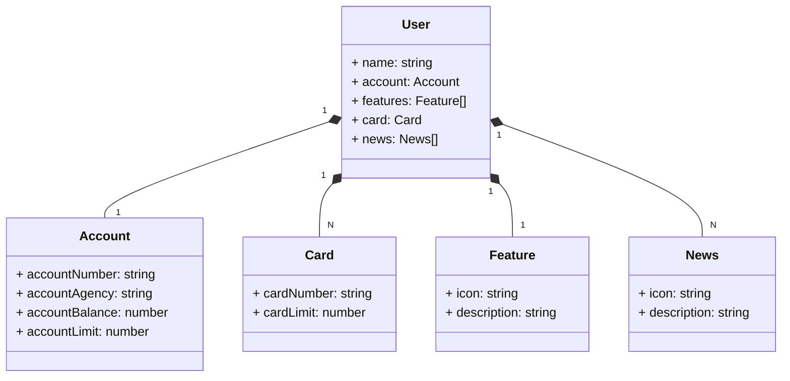

# santander-API
java RESTful API criada para o bootcamp Santander

##Diagrama de classes

```mermaid
classDiagram
  class User {
    + name: string
    + account: Account
    + features: Feature[]
    + card: Card
    + news: News[]
  }

  class Account {
    + accountNumber: string
    + accountAgency: string
    + accountBalance: number
    + accountLimit: number
  }

  class Feature {
    + icon: string
    + description: string
  }

  class Card {
    + cardNumber: string
    + cardLimit: number
  }

  class News {
    + icon: string
    + description: string
  }

  User "1" *-- "1" Account
  User "1" *-- "N" Card
  User "1" *-- "1" Feature
  User "1" *-- "N" News
```
